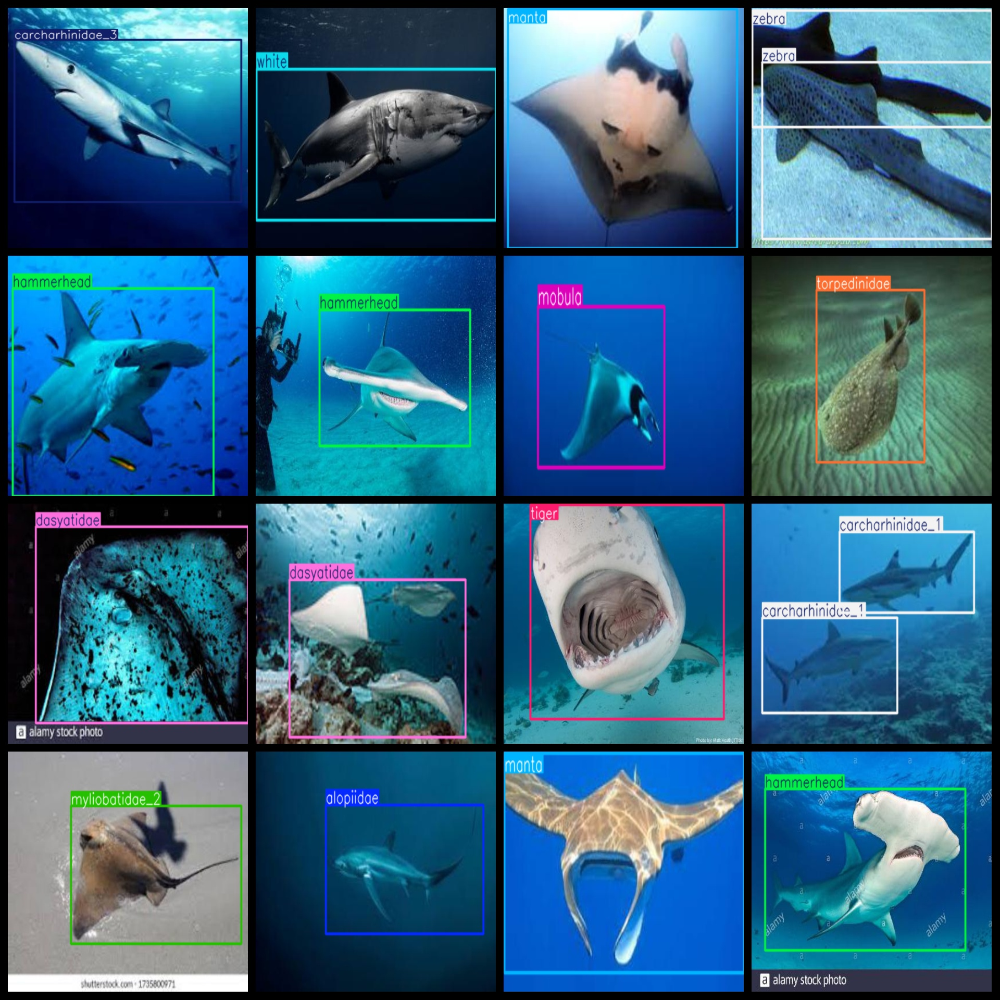
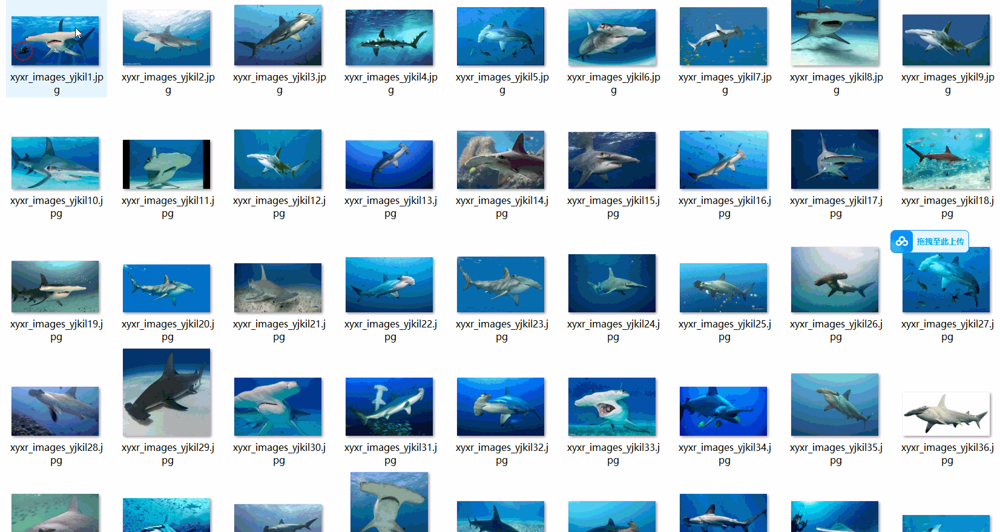

# Shark Classification Detection Dataset: 5433 Images in VOC+YOLO Format

The dataset consists of shark classification detection, with a total of 5433 images in VOC and YOLO format. It includes three folders for storing images, XML files, and text files. The JPEGImages folder contains a total of 5433 jpg images. The Annotations folder has 5433 xml files, and the labels folder has 5433 text files. There are 23 label categories, including "alopiidae," "basking," "carcharhinidae_1," "carcharhinidae_2," "carcharhinidae_3," "dasyatidae," "ginglymostomatidae," "guitarfish," "hammerhead," "mako," "manta," "mobula," "myliobatidae_1," "myliobatidae_2," "pelerin," "starspotted," "striped," "tiger," "torpedinidae," "trianodon," "whale," "white," and "zebra." Each label category has its own number of boxes (note that the yolo format class sequence does not match this, but is based on the classes.txt file in the labels folder).

For example, the number of boxes for the label "alopiidae" is 242, while for the label "basking" it is only 2. Similarly, the number of boxes for "carcharhinidae_1" is 1789, and for "carcharhinidae_2" it is 132. The number of boxes for "dasyatidae" is 615, and for "ginglymostomatidae" it is 309. The number of boxes for "guitarfish" is 95, and for "hammerhead" it is 684. The number of boxes for "mako" is 206, and for "manta" it is 306. The number of boxes for "mobula" is 658, and for "myliobatidae_1" it is 371. The number of boxes for "myliobatidae_2" is 152, and for "pelerin" it is 84. The number of boxes for "starspotted" is 30, and for "striped" it is 85. The number of boxes for "tiger" is 232, and for "torpedinidae" it is 119. The number of boxes for "trianodon" is 204, and for "whale" it is 281. The number of boxes for "white" is 199, and for "zebra" it is 156. The total number of boxes is 7165.

The resolution of the images is clear, with a high level of detail. The images have not been enhanced. The shape of the labels is rectangular boxes, used for target detection recognition.

Important Notes: No specific guarantees are made regarding the accuracy or precision of the models trained using this dataset. The dataset provides accurate and reasonable annotations only.

Annotations and Image Details:

## Images

---

Here is a pay link on Stripe (https://buy.stripe.com/3cs8yP7sY87d0vu9AB). Please contact me lonlonago@foxmail.com after funding $89, and I will send you a complete data files, thank you!

